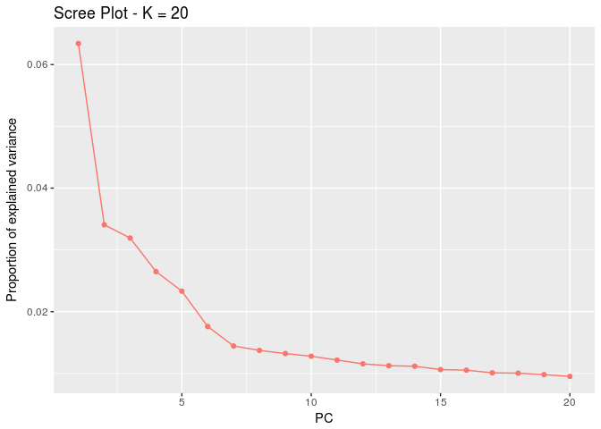
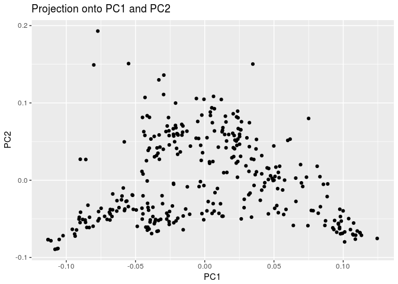
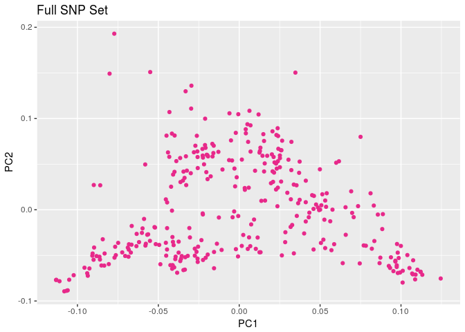

    library(pcadapt)

    ## Loading required package: robust

    ## Loading required package: fit.models

    ## Loading required package: MASS

    ## Loading required package: ggplot2

    ## Loading required package: vcfR

    ## 
    ##    *****       ***   vcfR   ***       *****
    ##    This is vcfR 1.6.0 
    ##      browseVignettes('vcfR') # Documentation
    ##      citation('vcfR') # Citation
    ##    *****       *****      *****       *****

    library(ggplot2)
    library(gridExtra)
    library(grid)
    library(lattice)
    library(RColorBrewer)

    path_to_full <- "/home/sarahturner/Documents/Bird_et_al/plinkGeneOmeSubset.ped"
    full <- read.pcadapt(path_to_full, type="ped")

    ## Summary:
    ## 
    ##         - input file      /home/sarahturner/Documents/Bird_et_al/plinkGeneOmeSubset.ped
    ##         - output file     /home/sarahturner/Documents/Bird_et_al/plinkGeneOmeSubset.pcadapt
    ## 
    ##  - number of individuals detected:   324
    ##  - number of loci detected:      213619
    ## 
    ## File has been sucessfully converted.

    full_x <- pcadapt(full, K=20)

    ## Reading file /home/sarahturner/Documents/Bird_et_al/plinkGeneOmeSubset.pcadapt...
    ## Number of SNPs: 213619
    ## Number of individuals: 324
    ## Number of SNPs with minor allele frequency lower than 0.05 ignored: 15070

    plot(full_x, option="screeplot")

    plot(full_x, option="scores")

    # color palette
    colorpal <- brewer.pal(4, "Dark2")

    p_full <- ggplot(as.data.frame(full_x$scores), aes(V1,V2)) + 
      geom_point(colour=colorpal[4]) +
      xlab("PC1") + ylab("PC2") +
      ggtitle("Full SNP Set")

    p_full

    path_to_AAS <- "/home/sarahturner/Documents/Bird_et_al/plinkAASubset.ped"
    AAS <- read.pcadapt(path_to_AAS, type="ped")

    ## Summary:
    ## 
    ##         - input file      /home/sarahturner/Documents/Bird_et_al/plinkAASubset.ped
    ##         - output file     /home/sarahturner/Documents/Bird_et_al/plinkAASubset.pcadapt
    ## 
    ##  - number of individuals detected:   324
    ##  - number of loci detected:      7667
    ## 
    ## File has been sucessfully converted.

    AAS_x  <- pcadapt(AAS, K=20)

    ## Reading file /home/sarahturner/Documents/Bird_et_al/plinkAASubset.pcadapt...
    ## Number of SNPs: 7667
    ## Number of individuals: 324
    ## Number of SNPs with minor allele frequency lower than 0.05 ignored: 621

    p_aas <- ggplot(as.data.frame(AAS_x$scores), aes(V1,V2)) +
      geom_point(colour=colorpal[1]) +
      xlab("PC1") + ylab("PC2") +
      ggtitle("Amino Acid Subset")

    p_aas

    path <- list()
    p_control <- list()

    control_samp <- as.character(sample(1:1000, 10, replace=FALSE))

    for (i in control_samp) {
      path[[i]] <- paste("/home/sarahturner/Documents/Bird_et_al/plink_subsets/plinkrandomSubset_", i, ".ped", sep="")
      print(path[[i]])
      control <- read.pcadapt(path[[i]], type="ped")
      control_x <- pcadapt(control, K=20)
      p_control[[i]] <- ggplot(as.data.frame(control_x$scores), aes(V1,V2)) +
        geom_point(colour=colorpal[2]) + 
        xlab("PC1") + ylab("PC2") +
        ggtitle(paste("Control SNP Set", i, sep=" "))
    }

    ## [1] "/home/sarahturner/Documents/Bird_et_al/plink_subsets/plinkrandomSubset_941.ped"
    ## Summary:
    ## 
    ##         - input file      /home/sarahturner/Documents/Bird_et_al/plink_subsets/plinkrandomSubset_941.ped
    ##         - output file     /home/sarahturner/Documents/Bird_et_al/plink_subsets/plinkrandomSubset_941.pcadapt
    ## 
    ##  - number of individuals detected:   324
    ##  - number of loci detected:      7667
    ## 
    ## File has been sucessfully converted.
    ## Reading file /home/sarahturner/Documents/Bird_et_al/plink_subsets/plinkrandomSubset_941.pcadapt...
    ## Number of SNPs: 7667
    ## Number of individuals: 324
    ## Number of SNPs with minor allele frequency lower than 0.05 ignored: 529
    ## [1] "/home/sarahturner/Documents/Bird_et_al/plink_subsets/plinkrandomSubset_954.ped"
    ## Summary:
    ## 
    ##         - input file      /home/sarahturner/Documents/Bird_et_al/plink_subsets/plinkrandomSubset_954.ped
    ##         - output file     /home/sarahturner/Documents/Bird_et_al/plink_subsets/plinkrandomSubset_954.pcadapt
    ## 
    ##  - number of individuals detected:   324
    ##  - number of loci detected:      7667
    ## 
    ## File has been sucessfully converted.
    ## Reading file /home/sarahturner/Documents/Bird_et_al/plink_subsets/plinkrandomSubset_954.pcadapt...
    ## Number of SNPs: 7667
    ## Number of individuals: 324
    ## Number of SNPs with minor allele frequency lower than 0.05 ignored: 543
    ## [1] "/home/sarahturner/Documents/Bird_et_al/plink_subsets/plinkrandomSubset_754.ped"
    ## Summary:
    ## 
    ##         - input file      /home/sarahturner/Documents/Bird_et_al/plink_subsets/plinkrandomSubset_754.ped
    ##         - output file     /home/sarahturner/Documents/Bird_et_al/plink_subsets/plinkrandomSubset_754.pcadapt
    ## 
    ##  - number of individuals detected:   324
    ##  - number of loci detected:      7667
    ## 
    ## File has been sucessfully converted.
    ## Reading file /home/sarahturner/Documents/Bird_et_al/plink_subsets/plinkrandomSubset_754.pcadapt...
    ## Number of SNPs: 7667
    ## Number of individuals: 324
    ## Number of SNPs with minor allele frequency lower than 0.05 ignored: 524
    ## [1] "/home/sarahturner/Documents/Bird_et_al/plink_subsets/plinkrandomSubset_409.ped"
    ## Summary:
    ## 
    ##         - input file      /home/sarahturner/Documents/Bird_et_al/plink_subsets/plinkrandomSubset_409.ped
    ##         - output file     /home/sarahturner/Documents/Bird_et_al/plink_subsets/plinkrandomSubset_409.pcadapt
    ## 
    ##  - number of individuals detected:   324
    ##  - number of loci detected:      7667
    ## 
    ## File has been sucessfully converted.
    ## Reading file /home/sarahturner/Documents/Bird_et_al/plink_subsets/plinkrandomSubset_409.pcadapt...
    ## Number of SNPs: 7667
    ## Number of individuals: 324
    ## Number of SNPs with minor allele frequency lower than 0.05 ignored: 520
    ## [1] "/home/sarahturner/Documents/Bird_et_al/plink_subsets/plinkrandomSubset_737.ped"
    ## Summary:
    ## 
    ##         - input file      /home/sarahturner/Documents/Bird_et_al/plink_subsets/plinkrandomSubset_737.ped
    ##         - output file     /home/sarahturner/Documents/Bird_et_al/plink_subsets/plinkrandomSubset_737.pcadapt
    ## 
    ##  - number of individuals detected:   324
    ##  - number of loci detected:      7667
    ## 
    ## File has been sucessfully converted.
    ## Reading file /home/sarahturner/Documents/Bird_et_al/plink_subsets/plinkrandomSubset_737.pcadapt...
    ## Number of SNPs: 7667
    ## Number of individuals: 324
    ## Number of SNPs with minor allele frequency lower than 0.05 ignored: 556
    ## [1] "/home/sarahturner/Documents/Bird_et_al/plink_subsets/plinkrandomSubset_379.ped"
    ## Summary:
    ## 
    ##         - input file      /home/sarahturner/Documents/Bird_et_al/plink_subsets/plinkrandomSubset_379.ped
    ##         - output file     /home/sarahturner/Documents/Bird_et_al/plink_subsets/plinkrandomSubset_379.pcadapt
    ## 
    ##  - number of individuals detected:   324
    ##  - number of loci detected:      7667
    ## 
    ## File has been sucessfully converted.
    ## Reading file /home/sarahturner/Documents/Bird_et_al/plink_subsets/plinkrandomSubset_379.pcadapt...
    ## Number of SNPs: 7667
    ## Number of individuals: 324
    ## Number of SNPs with minor allele frequency lower than 0.05 ignored: 549
    ## [1] "/home/sarahturner/Documents/Bird_et_al/plink_subsets/plinkrandomSubset_775.ped"
    ## Summary:
    ## 
    ##         - input file      /home/sarahturner/Documents/Bird_et_al/plink_subsets/plinkrandomSubset_775.ped
    ##         - output file     /home/sarahturner/Documents/Bird_et_al/plink_subsets/plinkrandomSubset_775.pcadapt
    ## 
    ##  - number of individuals detected:   324
    ##  - number of loci detected:      7667
    ## 
    ## File has been sucessfully converted.
    ## Reading file /home/sarahturner/Documents/Bird_et_al/plink_subsets/plinkrandomSubset_775.pcadapt...
    ## Number of SNPs: 7667
    ## Number of individuals: 324
    ## Number of SNPs with minor allele frequency lower than 0.05 ignored: 493
    ## [1] "/home/sarahturner/Documents/Bird_et_al/plink_subsets/plinkrandomSubset_324.ped"
    ## Summary:
    ## 
    ##         - input file      /home/sarahturner/Documents/Bird_et_al/plink_subsets/plinkrandomSubset_324.ped
    ##         - output file     /home/sarahturner/Documents/Bird_et_al/plink_subsets/plinkrandomSubset_324.pcadapt
    ## 
    ##  - number of individuals detected:   324
    ##  - number of loci detected:      7667
    ## 
    ## File has been sucessfully converted.
    ## Reading file /home/sarahturner/Documents/Bird_et_al/plink_subsets/plinkrandomSubset_324.pcadapt...
    ## Number of SNPs: 7667
    ## Number of individuals: 324
    ## Number of SNPs with minor allele frequency lower than 0.05 ignored: 494
    ## [1] "/home/sarahturner/Documents/Bird_et_al/plink_subsets/plinkrandomSubset_299.ped"
    ## Summary:
    ## 
    ##         - input file      /home/sarahturner/Documents/Bird_et_al/plink_subsets/plinkrandomSubset_299.ped
    ##         - output file     /home/sarahturner/Documents/Bird_et_al/plink_subsets/plinkrandomSubset_299.pcadapt
    ## 
    ##  - number of individuals detected:   324
    ##  - number of loci detected:      7667
    ## 
    ## File has been sucessfully converted.
    ## Reading file /home/sarahturner/Documents/Bird_et_al/plink_subsets/plinkrandomSubset_299.pcadapt...
    ## Number of SNPs: 7667
    ## Number of individuals: 324
    ## Number of SNPs with minor allele frequency lower than 0.05 ignored: 530
    ## [1] "/home/sarahturner/Documents/Bird_et_al/plink_subsets/plinkrandomSubset_76.ped"
    ## Summary:
    ## 
    ##         - input file      /home/sarahturner/Documents/Bird_et_al/plink_subsets/plinkrandomSubset_76.ped
    ##         - output file     /home/sarahturner/Documents/Bird_et_al/plink_subsets/plinkrandomSubset_76.pcadapt
    ## 
    ##  - number of individuals detected:   324
    ##  - number of loci detected:      7667
    ## 
    ## File has been sucessfully converted.
    ## Reading file /home/sarahturner/Documents/Bird_et_al/plink_subsets/plinkrandomSubset_76.pcadapt...
    ## Number of SNPs: 7667
    ## Number of individuals: 324
    ## Number of SNPs with minor allele frequency lower than 0.05 ignored: 551

    grid.arrange(p_full, p_aas, p_control[[1]], p_control[[2]], p_control[[3]], p_control[[4]], p_control[[5]], p_control[[6]],
                 p_control[[7]], p_control[[8]], p_control[[9]], p_control[[10]])

